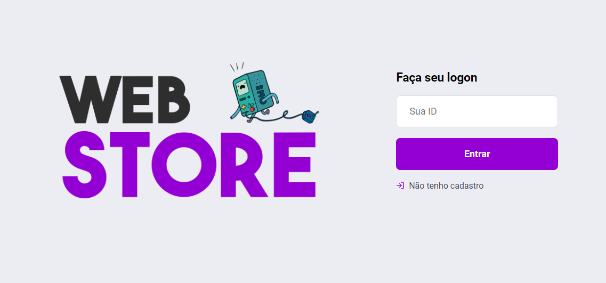
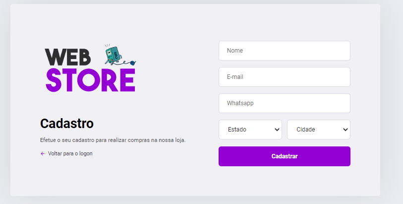
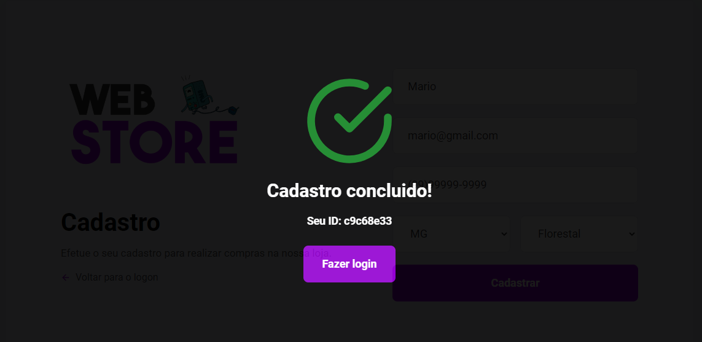
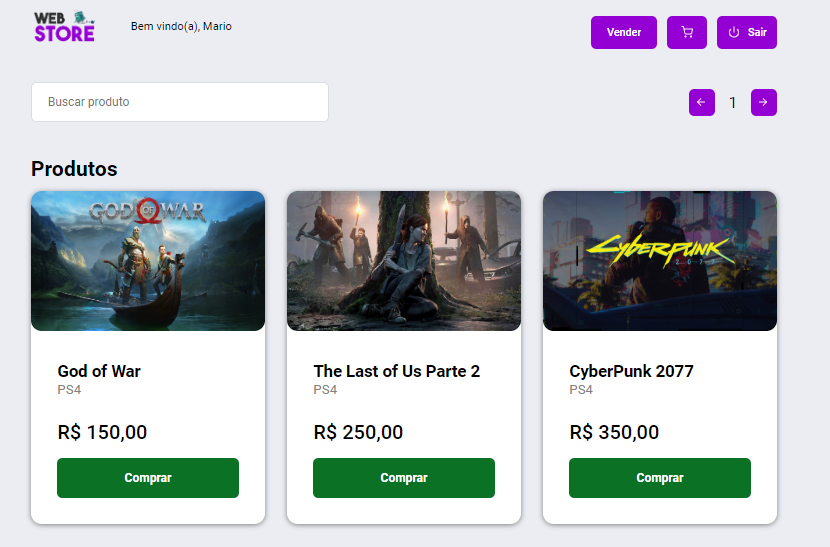
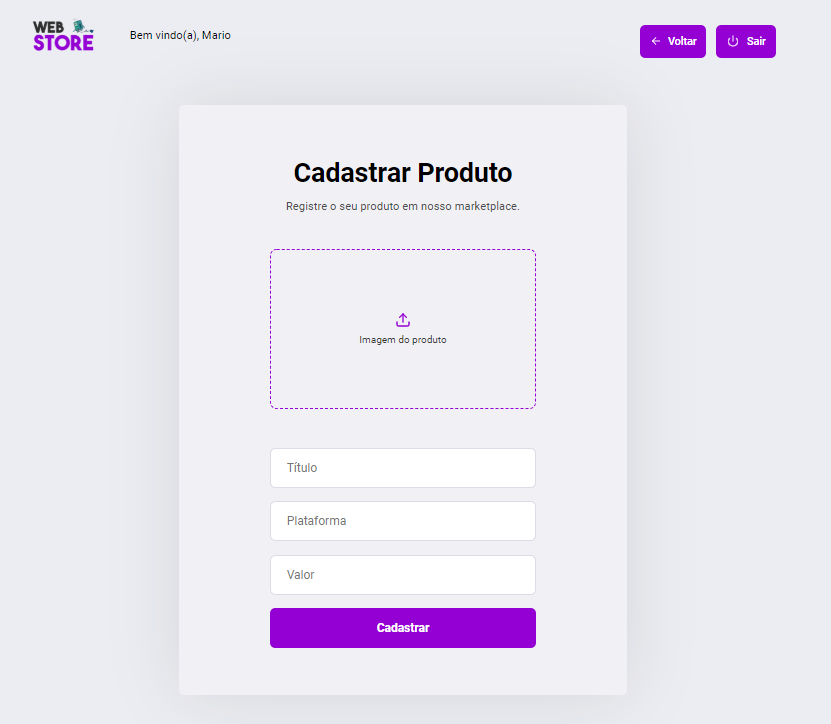
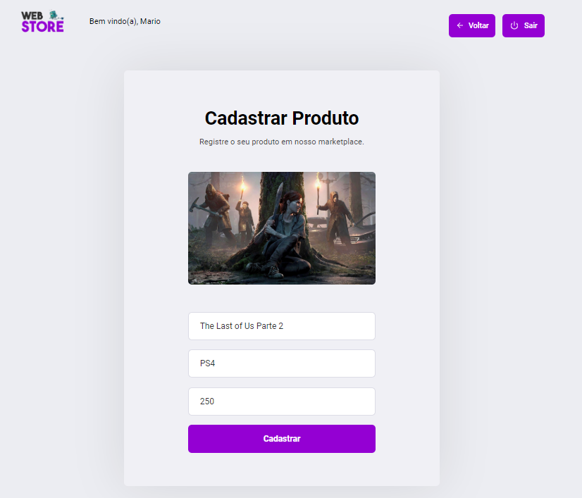
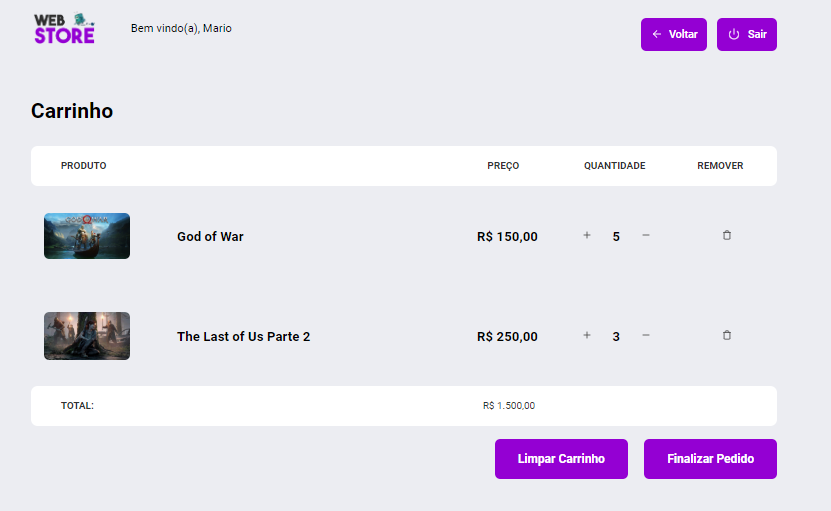

# Web Store

## Sobre o Projeto
 
Um marketplace de jogos em que o usuário pode comprar e vender jogos. Este projeto foi desenvolvido utilizando as tecnologias NodeJS/Express como back-end e React/Redux como front-end/web.

## Tecnologias

- NodeJS
- Express
- React
- Redux
- SQLite
